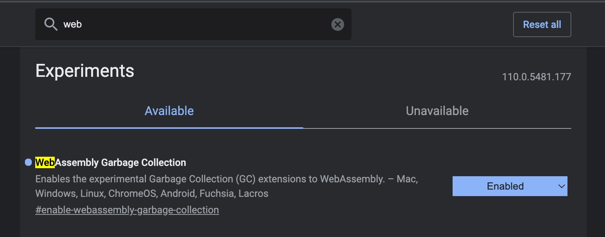

# wasmMandlebrot


## Build and run

To build and run the example execute follow command in a terminal:
```shell
gradle wasmBrowserRun -t
```

Point Chrome (and it needs to be chome at this web address:
```
http://localhost:8080/
```

Incidentally you need a modern chome with the WebAssembly Garbage Collection
setting enabled



